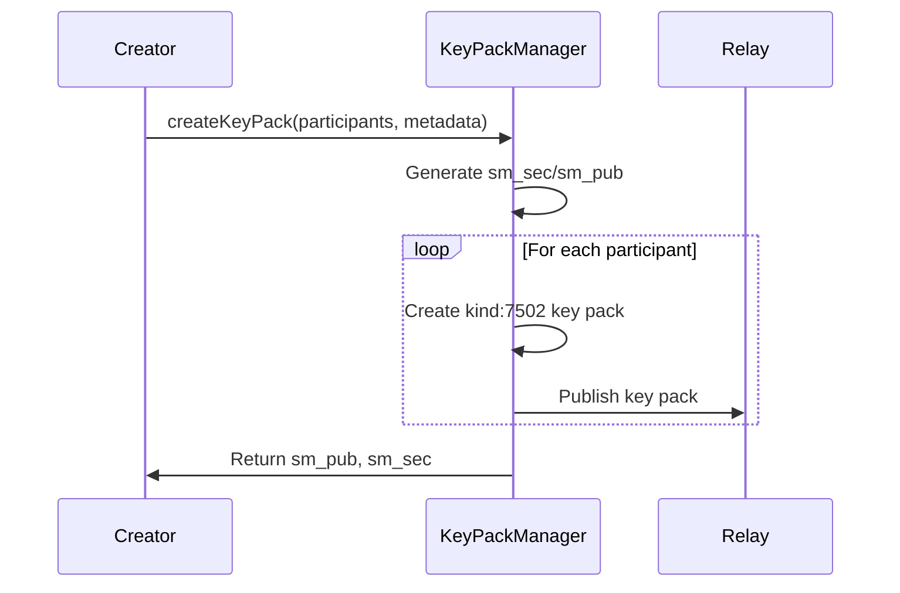
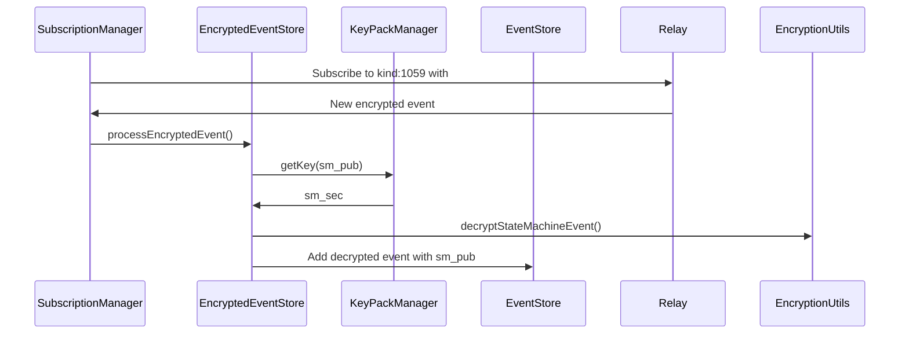

# Encrypted State Machines Implementation Guide

This document explains how end-to-end encrypted state machines are implemented in the AtoB web application, providing developers with a clear understanding of the architecture and key concepts.

## Overview

The encrypted state machines feature allows private delivery state machines where only authorized participants can read and write events. This is achieved through a combination of symmetric encryption and Nostr's gift wrap mechanism.

## Core Concepts

### 1. SM Shared Key Pair

Each encrypted delivery uses a dedicated Nostr key pair:

- **`sm_sec`**: Shared private key used for symmetric encryption
- **`sm_pub`**: Shared public key used as an identifier for the encrypted delivery

This key pair is generated once per encrypted delivery and shared among all authorized participants.

### 2. Key Distribution (Kind 7502)

To distribute the `sm_sec` to participants, we use **SM Key Pack events** (`kind: 7502`):

```typescript
// Key Pack Event Structure
{
  kind: 7502,
  content: "<encrypted-key-pack-content>",
  tags: [["p", "<participant-pubkey>"]],
  pubkey: "<ephemeral-pubkey>"
}
```

Each participant receives their own key pack event containing the `sm_sec` encrypted specifically for them using NIP-44.

### 3. Encrypted Event Wrapping (Kind 1059)

All state machine events (transitions, snapshots) are encrypted and wrapped using Nostr's gift wrap mechanism:

```typescript
// Gift Wrap Event Structure
{
  kind: 1059,
  content: "<encrypted-inner-event>",
  tags: [["p", "<sm_pub>"]],  // This is the key identifier!
  pubkey: "<ephemeral-pubkey>"
}
```

The `sm_pub` in the `p` tag is the crucial identifier that allows participants to discover events for a specific encrypted delivery.

## Implementation Architecture

### Key Components

#### 1. [`KeyPackManager`](src/lib/services/keyPackManager.svelte.ts)

- Manages storage and retrieval of SM shared keys
- Creates and distributes key packs to participants
- Provides access control checks

#### 2. [`SubscriptionManager`](src/lib/services/subs.svelte.ts)

- Sets up real-time subscriptions for:
  - **Key Packs**: Listens for `kind:7502` events tagged with user's pubkey
  - **Encrypted Events**: Listens for `kind:1059` events tagged with accessible `sm_pub` values
- Automatically updates subscriptions when new keys are discovered

#### 3. [`EncryptedEventStore`](src/lib/services/encryptedEventStore.ts)

- Processes incoming encrypted events
- Decrypts gift-wrapped events using stored SM keys
- Adds decrypted events to the main event store with `sm_pub` metadata

#### 4. [`Encryption Utilities`](src/lib/utils/encryption.ts)

- Provides core encryption/decryption functions
- Handles conversation key derivation for symmetric encryption
- Creates and processes key pack events

## Event Flow

### 1. Creating an Encrypted Delivery



### 2. Publishing Encrypted Events

```mermaid
sequenceDiagram
    participant Participant
    participant EncryptedEventStore
    participant Relay

    Participant->>EncryptedEventStore: encryptAndWrapEvent(innerEvent, sm_sec, sm_pub)
    EncryptedEventStore->>EncryptionUtils: encryptStateMachineEvent()
    EncryptionUtils->>EncryptionUtils: Create gift wrap with sm_pub tag
    EncryptedEventStore->>Relay: Publish encrypted event
```

### 3. Receiving Encrypted Events



## Identifying Encrypted Deliveries

### In the UI

Encrypted deliveries are identified by the presence of `sm_pub` in the delivery model:

```typescript
// Delivery model with encryption
interface Delivery {
	// ... other fields
	sm_pub?: string; // Present if encrypted
}
```

The [`EncryptionBadge`](src/lib/components/EncryptionBadge.svelte) component displays a lock icon when `sm_pub` is present.

### In Event Processing

When processing events from the event store:

```typescript
// Check if event is from encrypted delivery
if (event.sm_pub) {
	// This event came from an encrypted delivery
	const hasAccess = keyPackManager.hasAccess(event.sm_pub);
}
```

## Key Technical Details

### 1. Conversation Key Derivation

For symmetric encryption with the shared key, we derive a conversation key:

```typescript
function deriveSMConversationKey(sm_sec: string, sm_pub: string): Uint8Array {
	return nip44.v2.utils.getConversationKey(hexToBytes(sm_sec), sm_pub);
}
```

This follows NIP-44's conversation key derivation but uses the shared key as both private and public components.

### 2. Ephemeral Keys

All wrapper events (both key packs and gift wraps) are signed with random ephemeral keypairs to:

- Protect participant anonymity
- Decouple encrypted events from personal pubkeys
- Prevent correlation between different events

### 3. Real-time Updates

The subscription manager maintains permanent subscriptions that:

- Automatically discover new key packs for the logged-in user
- Update encrypted event subscriptions when new keys are available
- Process incoming encrypted events in real-time

## Adding New Participants

To add a participant to an existing encrypted delivery:

```typescript
await keyPackManager.addParticipant(sm_pub, newParticipantPubkey);
```

This creates and publishes a new key pack event for the new participant, giving them access to the entire delivery history.

## Security Considerations

- **Forward Secrecy**: New participants can access the entire history once they receive the key pack
- **Content Privacy**: Only authorized participants can read event contents
- **Participant Anonymity**: Ephemeral keys prevent correlation between events
- **Access Control**: The `sm_pub` tag allows efficient filtering while maintaining privacy

## Common Patterns

### Checking Access to Encrypted Delivery

```typescript
const hasAccess = keyPackManager.hasAccess(delivery.sm_pub);
```

### Publishing Encrypted Transition

```typescript
if (delivery.sm_pub) {
	const sm_sec = keyPackManager.getKey(delivery.sm_pub);
	if (sm_sec) {
		const encryptedEvent = await encryptedEventStore.encryptAndWrapEvent(
			transitionEvent,
			sm_sec,
			delivery.sm_pub
		);
		await publishEvent(encryptedEvent);
	}
}
```

This documentation should help new developers understand how encrypted state machines work and how to work with them in the codebase.
