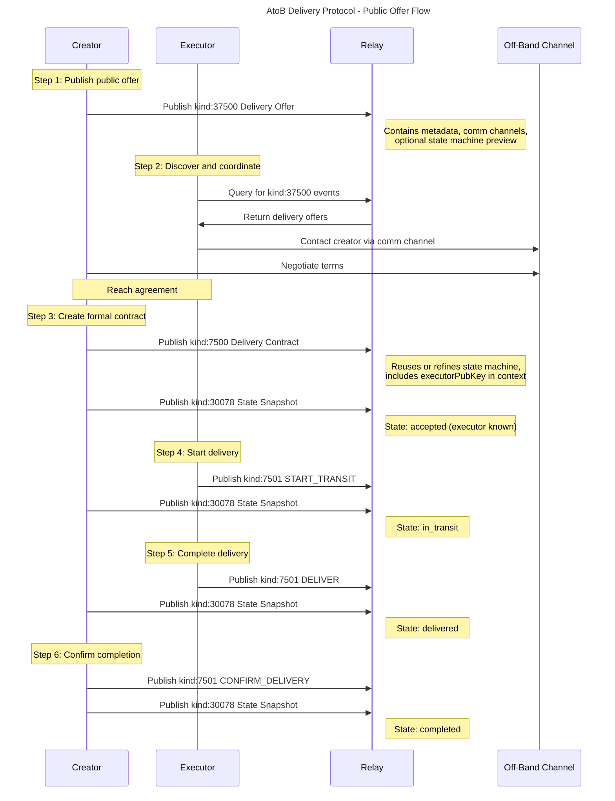
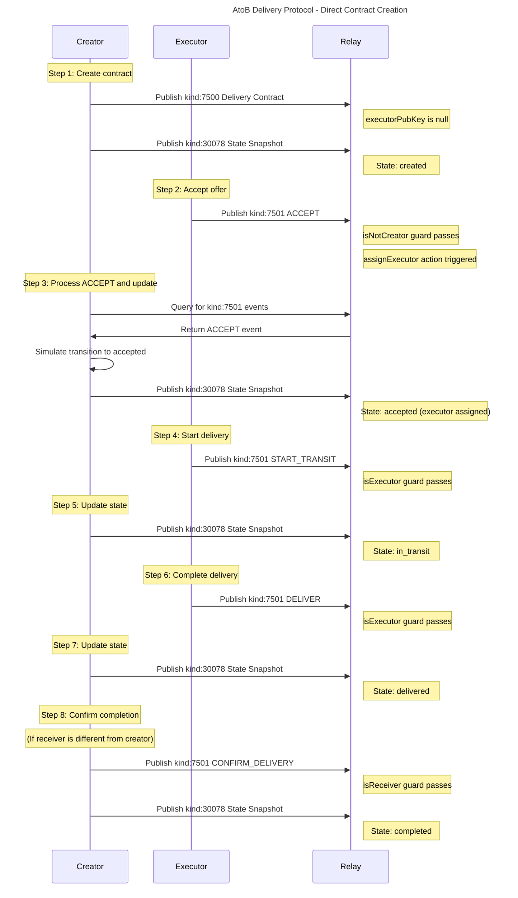

# AtoB Delivery Protocol: An Implementation of State Machines on Nostr

## 1. Abstract

AtoB is a protocol for coordinating peer-to-peer (p2p) physical package deliveries over Nostr. It serves as a specific application of the general-purpose [State Machines on Nostr](./state-machines-on-nostr.md) protocol.

This document details the state machine, events, and actor model for the delivery use case. It allows a user (`creator`) to announce a delivery job, and another user (`executor`) to accept and complete it.

## 2. Actors

- **Creator**: The user who creates the delivery offer and defines the terms of the contract and its state machine.
- **Executor**: The user who accepts the delivery offer and performs the delivery.

## 3. Event Structure

The AtoB protocol uses the event kinds as defined in the base specification, plus a new kind for announcing delivery offers.

### Kind 37500: Delivery Offer (Optional)

This is a **parameterized replaceable event** that functions as an optional, preliminary announcement for a potential delivery. It is fully decoupled from the state machine contract. Its purpose is to allow creators to advertise a delivery need and for potential executors to discover opportunities.

All communication following a delivery offer happens off-band (e.g., via channels specified in `comm` tags). The terms in the offer may be considered initial proposals, subject to negotiation.

The `content` field **may optionally** contain a stringified JSON of a state machine definition (following the same structure as [`Kind 7500`](spec/atob-delivery-protocol.md:50)). This allows the creator to present a draft, template, or preview of the state machine that will be used for the delivery. If no state machine preview is needed, the `content` field can be an empty string.

For discoverability and human-readable context, the following tags are recommended but optional:

```json
{
  "kind": 37500,
  "pubkey": "<creator-pubkey>",
  "content": "<Optional: Stringified JSON of a State Machine Definition - see Kind 7500 example>",
  "tags": [
    ["d", "<unique-identifier-for-the-offer>"],
    ["title", "Concise title for the delivery"],
    [
      "description",
      "Free-form description of the delivery, requirements, etc."
    ],
    ["engine", "xstate@5", "state-machine"],
    ["engine", "npm:@atob/protocol-library@^0.1.0", "guards", "actions"],
    ["pickup_geohash", "<geohash for pickup location>"],
    ["dropoff_geohash", "<geohash for dropoff location>"],
    ["amount", "<integer in sats>"],
    ["deadline", "<Unix timestamp in seconds>"],
    ["role", "executor"],
    ["comm", "nostr", "nip17"],
    ["comm", "email", "user@example.com"]
  ]
}
```

- **`description` tag**: Contains a free-form, human-readable description of the delivery, including requirements and other relevant details.
- **`engine` tags** (optional): When a state machine definition is included in `content`, these tags specify the execution dependencies, following the same format as [`Kind 7500`](spec/atob-delivery-protocol.md:50).
- **`role` tag**: Specifies a role the creator is looking to fill (e.g., `["role", "executor"]`). Multiple tags can be used if multiple roles of the same type are needed.
- **`comm` tag**: Defines a communication channel for off-band coordination.

Since this event is decoupled, it does **not** contain an `e` tag referencing a state machine contract.

#### Benefits of This Structure

By using the same structure for both [`Kind 37500`](spec/atob-delivery-protocol.md:18) and [`Kind 7500`](spec/atob-delivery-protocol.md:50):

- **Consistency**: Both events share similar metadata structure, making them easier to work with programmatically.
- **Reusability**: A public offer can be more easily transformed into an actual state machine definition, as both contain similar metadata and potentially the same state machine in the `content` field.
- **Flexibility**: Creators can choose to include a complete state machine preview, a simplified template, or no state machine at all (empty `content`), depending on how much detail they want to share publicly.
- **Progressive Enhancement**: Potential executors can see the proposed workflow upfront, facilitating better off-band negotiation and reducing surprises when the formal contract is created.

### Kind 7500: Delivery Contract

This is a **regular event** that defines the final, immutable delivery contract. It contains the agreed-upon terms and the state machine logic. It remains self-contained and includes all metadata necessary to understand the contract, even if it was preceded by a Delivery Offer.

```json
{
  "kind": 7500,
  "content": "<Stringified JSON of the Delivery State Machine Definition - see example below>",
  "tags": [
    ["state", "30078:<creator-pubkey>:<d_tag>"],
    ["title", "Concise title for the delivery"],
    ["description", "Detailed description of the delivery"],
    ["engine", "xstate@5", "state-machine"],
    ["engine", "npm:@atob/protocol-library@^0.1.0", "guards", "actions"],
    ["pickup_geohash", "<geohash for pickup location (optional)>"],
    ["dropoff_geohash", "<geohash for dropoff location (optional)>"],
    ["amount", "<integer in sats (optional)>"],
    ["deadline", "Unix timestamp in seconds (optional)"]
  ]
}
```

- The `state`, `title`, `description`, and `engine` tags function as described in the base protocol.
- The `engine` tag for `@atob/protocol-library` is recommended, as this library provides the standard guards and actions for this use case.
- Delivery-specific tags like `pickup_geohash`, `dropoff_geohash`, `amount`, and `deadline` provide metadata for clients to display and interpret the delivery offer.

### State Machine Definition Example (`content` field)

This example demonstrates a compliant XState v5 definition for the delivery use case.

```json
{
  "id": "atob-delivery",
  "initial": "created",
  "context": {
    "creatorPubKey": "npub1...",
    "executorPubKey": null,
    "receiverPubKey": "npub1...",
    "inputterPubKey": null
  },
  "states": {
    "created": {
      "on": {
        "ACCEPT": {
          "target": "accepted",
          "guard": "isNotCreator",
          "actions": "assignExecutor"
        },
        "CANCEL": {
          "target": "canceled",
          "guard": "isCreator"
        }
      }
    },
    "accepted": {
      "on": {
        "START_TRANSIT": {
          "target": "in_transit",
          "guard": "isExecutor"
        },
        "CANCEL": {
          "target": "canceled",
          "guard": "isCreatorOrExecutor"
        }
      }
    },
    "in_transit": {
      "on": {
        "DELIVER": {
          "target": "delivered",
          "guard": "isExecutor"
        },
        "DISPUTE": {
          "target": "disputed",
          "guard": "isCreatorOrExecutor"
        }
      }
    },
    "delivered": {
      "on": {
        "CONFIRM_DELIVERY": {
          "target": "completed",
          "guard": "isReceiver"
        }
      }
    },
    "completed": {
      "type": "final"
    },
    "canceled": {
      "type": "final"
    },
    "disputed": {}
  }
}
```

### Guards and Actions

The `guard` and `actions` properties in the state machine definition refer to named implementations that a client must provide. For the AtoB delivery protocol, the recommended `@atob/protocol-library` provides these standard implementations, as declared in the contract's `engine` tags.

- **Guards (Conditions)**:
  - `isCreator`: Checks if the `inputterPubKey` is the contract creator.
  - `isNotCreator`: Checks if the `inputterPubKey` is not the contract creator.
  - `isExecutor`: Checks if the `inputterPubKey` is the assigned executor.
  - `isReceiver`: Checks if the `inputterPubKey` is the designated receiver.
  - `isCreatorOrExecutor`: Checks if the `inputterPubKey` is either the creator or the executor.
- **Actions (Effects)**:
  - `assignExecutor`: Assigns the `inputterPubKey` as the `executorPubKey` in the context.

### State Machine Flow Diagram

```mermaid
---
title: AtoB Delivery State Machine
---
stateDiagram-v2
    [*] --> created

    created --> accepted: ACCEPT [!isCreator] / assignExecutor
    created --> canceled: CANCEL [isCreator]

    accepted --> in_transit: START_TRANSIT [isExecutor]
    accepted --> canceled: CANCEL [isCreatorOrExecutor]

    in_transit --> delivered: DELIVER [isExecutor]
    in_transit --> disputed: DISPUTE [isCreatorOrExecutor]

    delivered --> completed: CONFIRM_DELIVERY [isReceiver]

    completed --> [*]
    canceled --> [*]

    note right of created
        <b>Guards (Conditions):</b>
        isCreator: Inputter is the contract creator.
        !isCreator: Inputter is not the contract creator.
        isExecutor: Inputter is the assigned executor.
        isReceiver: Inputter is the designated receiver.
        isCreatorOrExecutor: Inputter is the creator or the executor.
        <br>
        <b>Actions (Effects):</b>
        assignExecutor: Assigns the inputter's pubkey as the executor.
    end note
```



### Client Implementation

A client implementing the AtoB protocol would use a library like `@atob/protocol-library` to provide the necessary guards and actions to XState's `createMachine` function.

```javascript
import { createMachine } from "xstate";
// Import the pluggable guards and actions from the reference library
import {
  assignExecutor,
  isCreator,
  isExecutor,
  isNotCreator,
  isCreatorOrExecutor,
  isReceiver,
} from "@atob/protocol-library";

// Example Nostr event for a Delivery Contract (kind 7500)
const contractEvent = {
  // ... (other Nostr event fields like id, pubkey, created_at, etc.)
  id: "abc_event_id_123",
  kind: 7500,
  content: '{ "id": "atob-delivery", ... }', // The full machine definition
  tags: [
    ["state", "30078:npub1...:unique_identifier"],
    ["engine", "xstate@5", "state-machine"],
    ["engine", "npm:@atob/protocol-library@^0.1.0", "guards", "actions"],
    // ... other tags
  ],
};

// 1. Parse the JSON string from the contract event's content field
const atobMachineDefinition = JSON.parse(contractEvent.content);

// 2. Create the XState machine with the imported implementations
const atobMachine = createMachine(atobMachineDefinition, {
  actions: {
    assignExecutor,
  },
  guards: {
    isNotCreator,
    isCreator,
    isExecutor,
    isCreatorOrExecutor,
    isReceiver,
  },
});

// The 'atobMachine' can now be used with an XState interpreter.
```

## 4. Example Flows

The protocol supports two main flows: one starting with a public offer, and one where the contract is created directly.

### Flow 1: Starting with a Public Delivery Offer

This flow is used when the creator wants to publicly announce a delivery and find an executor.



1.  **Creator Publishes Offer**: The `creator` publishes a **Kind 37500** `Delivery Offer` event. This event includes:
    - Metadata like price, locations, and communication channels (`comm` tags)
    - A `description` tag with human-readable details
    - Optionally, a state machine definition in the `content` field as a preview or template of the proposed workflow
2.  **Off-Band Coordination**: An interested `executor` discovers the offer and contacts the `creator` using one of the specified communication channels. They negotiate and agree on the terms. If a state machine preview was included in the offer, both parties can reference it during negotiation.
3.  **Creator Creates Contract**: Once an agreement is reached, the `creator` creates the formal contract:
    - They publish a **Kind 7500** event with the final, agreed-upon metadata and the state machine definition. If a state machine was included in the [`Kind 37500`](spec/atob-delivery-protocol.md:18) offer, it can be reused directly or refined based on the negotiation. The `executorPubKey` may be pre-filled in the machine's `context`.
    - They publish a **Kind 30078** event with the initial state snapshot. Because `executorPubKey` is known, the machine will automatically transition from `created` to `accepted`.
4.  **Executor Starts Transit**: The `executor` publishes a **Kind 7501** input with `["t", "START_TRANSIT"]`.
5.  **State Transitions Continue**: The process continues as described in the base specification, with the custodian and participants updating the `Kind 30078` state snapshot in response to `Kind 7501` inputs (`DELIVER`, `CONFIRM_DELIVERY`, etc.).

### Flow 2: Direct Contract Creation

This flow is used when the parties have already coordinated and are ready to start the delivery process without a public announcement.



1.  **Creator Creates Contract**: The `creator`'s client publishes a **Kind 7500** event and a **Kind 30078** event with the initial state. In this case, `executorPubKey` is `null`, so the machine initializes with the `created` state.
2.  **Executor Accepts Offer**: An `executor` publishes a **Kind 7501** input event with `["t", "ACCEPT"]`.
3.  **Creator Validates and Updates State**:
    - The `creator`'s client (custodian) receives the `ACCEPT` input.
    - It simulates the transition. The `isNotCreator` guard passes, and the `assignExecutor` action is triggered. The state machine generates a `nextState` object for the `"accepted"` state.
    - The `creator` publishes a new version of the **Kind 30078** event with the new state snapshot.
4.  **Process Continues**: The lifecycle continues with `START_TRANSIT`, `DELIVER`, and `CONFIRM_DELIVERY` inputs until the machine reaches a final state.
