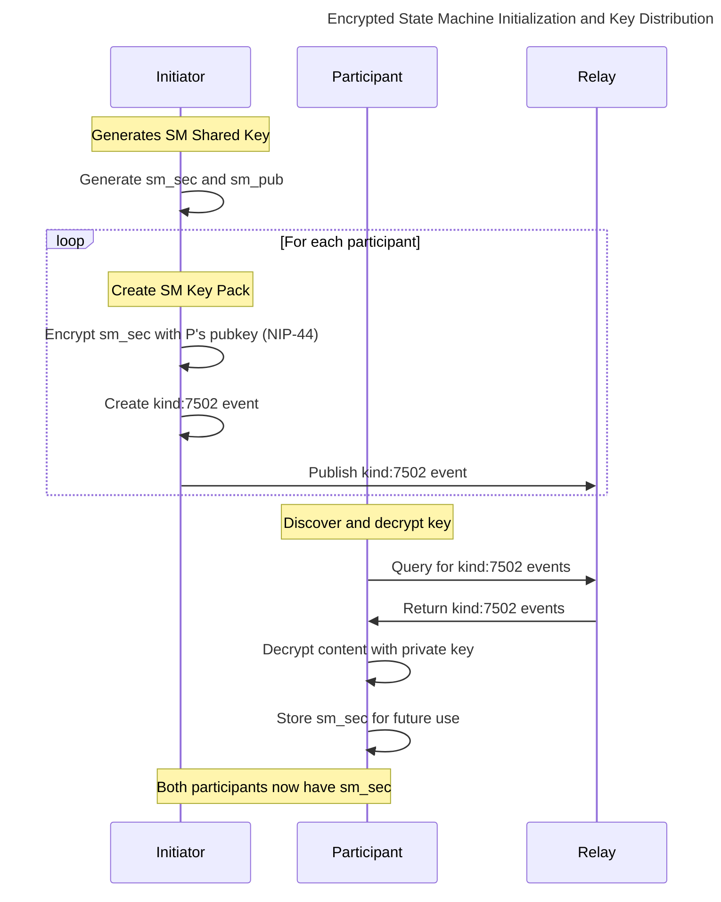
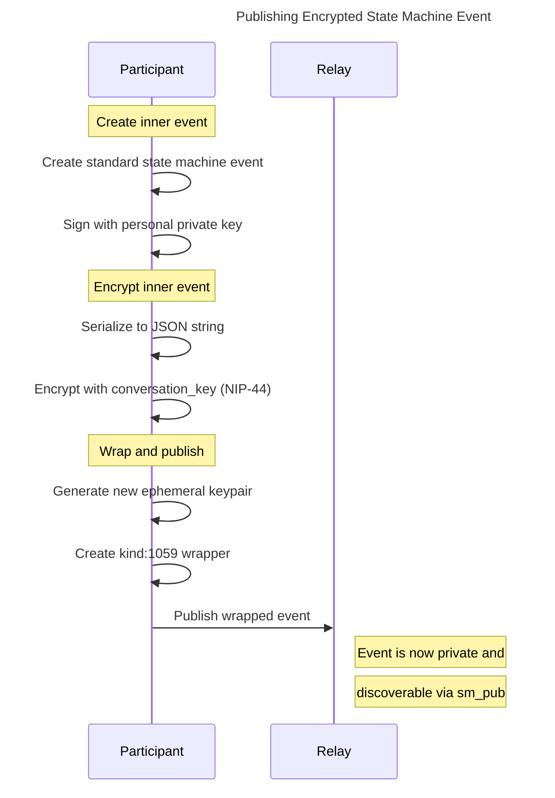
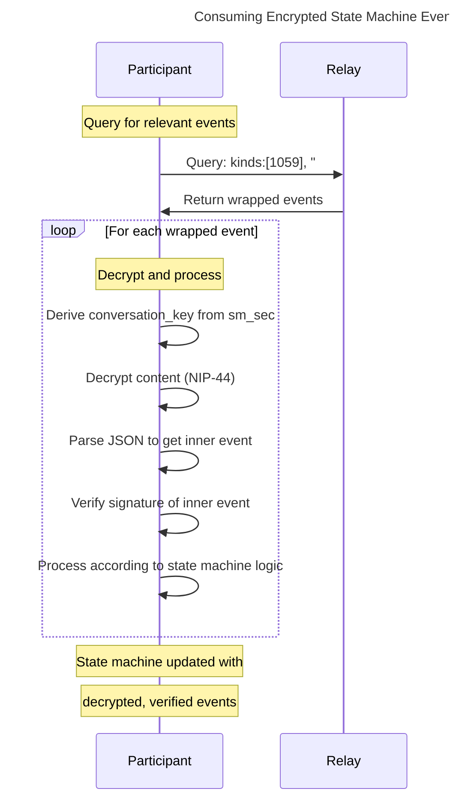
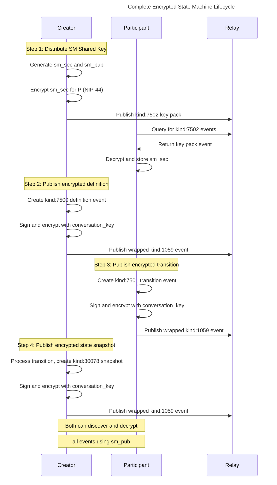

# End-to-End Encrypted State Machines over Nostr

## 1. Abstract

This document specifies a convention for applying end-to-end encryption (E2EE) to state machine lifecycles as defined in the "State Machines over Nostr" specification. The goal is to provide a flexible, scalable, and robust encryption layer that ensures the privacy of all state machine events, including definitions, transitions, and snapshots.

This is achieved by introducing a **State Machine (SM) Shared Key** that is used for symmetric encryption among all participants. This key is securely distributed using an **SM Key Pack** (`kind: 7502`), where each event is encrypted for a specific participant using NIP-44. All subsequent state machine events are then encrypted with the shared key and published within a standard `kind: 1059` gift wrap, ensuring privacy and reducing encryption overhead.

## 2. Requirements

The design of this encryption scheme adheres to the following principles:

1.  **Thin Layer:** The encryption mechanism is a minimal layer on top of the existing state machine specification, requiring no fundamental changes to the core logic.
2.  **Scalability:** The scheme must efficiently handle an arbitrary number of participants without the linear increase in encryption overhead that comes with per-participant encryption for every message.
3.  **Flexibility:** The system must allow for new participants to be added during the state machine's lifecycle, granting them access to the complete history of events.

## 3. Core Concepts

### 3.1. State Machine (SM) Shared Key

The foundation of this encryption scheme is a single, randomly generated Nostr keypair, referred to as the "SM Shared Key".

- **Shared Private Key (`sm_sec`):** This key is used as a symmetric encryption key, shared among all authorized participants.
- **Shared Public Key (`sm_pub`):** This key serves as a public identifier for the encrypted state machine instance. It is used in `p` tags in the gift wrap events `kind: 1059` to allow participants to discover related events to the state machine.

All participants in possession of the `sm_sec` can encrypt and decrypt messages.

### 3.2. SM Key Pack (Kind 7502)

The "SM Key Pack" is not a single event, but a **collection of events** used to securely distribute the `sm_sec` to all initial participants. To distinguish these key distribution events from other wrapped messages, this protocol uses a dedicated `kind: 7502`.

To create the SM Key Pack, the initiator of the state machine performs the following for each participant `P_i`:

1.  **Encrypt the Key:** The `sm_sec` is encrypted for the participant's public key (`P_i_pub`) using NIP-44.
2.  **Wrap the Key:** The resulting encrypted payload is placed into the `content` of a `kind: 7502` event.
3.  **Tag the Recipient:** The `kind: 7502` event includes a `p` tag referencing the participant's public key (`P_i_pub`).
4.  **Publish:** The event is signed with an ephemeral key and published to the relays.

This process results in one `kind: 7502` event per participant, each containing the `sm_sec` encrypted specifically for them.

#### 3.2.1 Key Pack Metadata

Key packs can include metadata to help users identify and organize their secure spaces. The encrypted content of a `kind: 7502` event may contain:

```typescript
interface KeyPackContent {
  sm_sec: string; // SM Shared Private Key
  sm_pub: string; // SM Shared Public Key
  metadata?: {
    id: string; // Unique identifier for the key pack
    name: string; // User-friendly name (e.g., "NYC Delivery #123")
    description?: string; // Optional description
  };
}
```

This metadata helps users understand what each key pack provides access to and enables better organization of their encrypted state machines.

### 3.3. Gift wrap usage (Kind 1059)

All subsequent events in the state machine's lifecycle (definitions, transitions, snapshots) are encrypted and wrapped using a standard `kind: 1059` (Gift Wrap) event. This pattern ensures that the event content is private and that the event's origin is decoupled from the participant's personal public key.

The process is as follows:

1.  **Prepare Inner Event:** The standard state machine event (e.g., a transition event) is created and signed with the participant's personal key, as per the base specification.
2.  **Encrypt Inner Event:** The entire inner event, serialized as a JSON string, is encrypted using NIP-44 with the shared `conversation_key` derived from the SM Shared Key.
3.  **Wrap in `kind: 1059`:** The resulting ciphertext becomes the `content` of a new `kind: 1059` event.
    - This outer event is signed by a **new, random ephemeral keypair**.
    - It contains a single `p` tag referencing the **Shared Public Key (`sm_pub`)**.

This approach ensures that all messages are encrypted once to the shared context and can be discovered by any participant who knows the `sm_pub`.

## 4. Event Flows

### 4.1. Flow: Initialization and Key Distribution



1.  **Initiator generates the SM Shared Key:**

    ```typescript
    const sm_sec = generateSecretKey();
    const sm_pub = getPublicKey(sm_sec);
    ```

2.  **Initiator creates and publishes the SM Key Pack:** For each participant with public key `participant_pubkey`:
    a. Encrypt the key pack content for the participant.
    b. Create a `kind: 7502` wrapper event.

    **Example `kind: 7502` wrapper for one participant's key:**

    ```json
    {
      "id": "<wrapper-hash>",
      "pubkey": "<random-ephemeral-pubkey>",
      "created_at": 1680000000,
      "kind": 7502,
      "tags": [["p", "<participant_pubkey>"]],
      "content": "<nip44-encrypted-keypackcontent>",
      "sig": "<ephemeral-key-signature>"
    }
    ```

3.  **Participant receives their key:**
    a. The participant queries for `kind: 7502` events `p`-tagged with their public key.
    b. Upon finding a key pack event, they use their personal private key to decrypt the `content` using NIP-44.
    c. The decrypted content contains the `sm_sec`, which they can use to encrypt messages for the shared key.

### 4.2. Flow: Publishing an Encrypted State Machine Event



1.  **A participant creates a standard `kind: 7501` transition event:**

    ```json
    // Inner Event
    {
      "kind": 7501,
      "pubkey": "<participant-personal-pubkey>",
      "content": "{\"note\":\"Pickup confirmed by driver\"}",
      "tags": [
        ["e", "<state-machine-definition-id>"],
        ["t", "CONFIRM_PICKUP"]
      ]
    }
    ```

    _This event is then signed as usual._

2.  **The participant encrypts the signed inner event:**
    a. The signed event is serialized to a JSON string.
    b. This string is encrypted using NIP-44 with the `conversation_key` derived from the `sm_sec` and `sm_pub`.

3.  **The participant wraps and publishes the encrypted event:**

    **Example Encrypted and Wrapped Transition Event (`kind: 1059`):**

    ```json
    {
      "id": "<wrapper-hash>",
      "pubkey": "<random-ephemeral-pubkey>",
      "created_at": 1680000100,
      "kind": 1059,
      "tags": [["p", "<sm_pub>"]],
      "content": "<nip44-encrypted-signed-inner-event>",
      "sig": "<ephemeral-key-signature>"
    }
    ```

### 4.3. Flow: Consuming Encrypted Events



1.  **A participant queries for events:** They use the stored `sm_pub` to query relays for all relevant events.

    ```
    Query: { kinds: [1059], "#p": [sm_pub] }
    ```

2.  **The participant decrypts the wrapped events:**
    a. For each `kind: 1059` event received, they use the stored `sm_sec` to derive the `conversation_key`.
    b. They use this key to decrypt the `content` of the wrapper event via NIP-44.

3.  **The participant processes the inner event:**
    a. The decrypted content is a JSON string of the original, signed state machine event.
    b. The participant parses the JSON, verifies the signature of the inner event against the `pubkey` within it, and processes it according to the state machine logic.

## 5. Example Lifecycle Flow

This section illustrates a complete, simplified lifecycle of an encrypted state machine.



**Actors:**

- **Creator:** `npub1creator...`
- **Participant:** `npub1participant...`

**Keys:**

- **SM Shared Key:**
  - `sm_sec`: `nsec1shared...`
  - `sm_pub`: `npub1shared...`

### Step 1: Creator Distributes the SM Shared Key

The Creator sends the `sm_sec` to the Participant by encrypting it to their public key and wrapping it in a `kind: 7502` event.

```json
// Kind 7502 SM Key Pack Event
{
  "kind": 7502,
  "pubkey": "<ephemeral_pubkey_1>",
  "tags": [["p", "<participant_pubkey>"]],
  "content": "<NIP44(keypack_content, participant_pubkey)>",
  "sig": "..."
}
```

The Participant queries for `kind: 7502` events, finds this one, decrypts the content to get the `sm_sec`, and stores it.

### Step 2: Creator Publishes the Encrypted State Machine Definition

The Creator first creates the standard `kind: 7500` definition event, then encrypts and wraps it.

**Inner Event (`kind: 7500`):**

```json
{
  "id": "<definition_id>",
  "kind": 7500,
  "pubkey": "<creator_pubkey>",
  "content": "{\"id\":\"delivery_sm\",\"initial\":\"...\",...}",
  "tags": [
    ["state", "30078:<creator_pubkey>:<d_tag>"],
    ["title", "Encrypted Delivery"]
  ],
  "sig": "..."
}
```

**Outer Wrapper (`kind: 1059`):**

```json
{
  "kind": 1059,
  "pubkey": "<ephemeral_pubkey_2>",
  "tags": [["p", "<sm_pub>"]],
  "content": "<NIP44(JSON.stringify(inner_event_7500), sm_pub)>",
  "sig": "..."
}
```

### Step 3: Participant Publishes an Encrypted Transition Event

The Participant triggers a transition by creating, signing, encrypting, and wrapping a `kind: 7501` event.

**Inner Event (`kind: 7501`):**

```json
{
  "id": "<transition_id>",
  "kind": 7501,
  "pubkey": "<participant_pubkey>",
  "content": "{}",
  "tags": [
    ["e", "<definition_id>"],
    ["t", "CONFIRM_PICKUP"]
  ],
  "sig": "..."
}
```

**Outer Wrapper (`kind: 1059`):**

```json
{
  "kind": 1059,
  "pubkey": "<ephemeral_pubkey_3>",
  "tags": [["p", "<sm_pub>"]],
  "content": "<NIP44(JSON.stringify(inner_event_7501), sm_pub)>",
  "sig": "..."
}
```

### Step 4: Creator (as Custodian) Publishes the Encrypted State Snapshot

After processing the transition, the Creator updates the state by publishing a new encrypted and wrapped `kind: 30078` snapshot.

**Inner Event (`kind: 30078`):**

```json
{
  "id": "<snapshot_id>",
  "kind": 30078,
  "pubkey": "<creator_pubkey>",
  "content": "{\"value\":\"IN_TRANSIT\",\"context\":{...},...}",
  "tags": [
    ["d", "<d_tag>"],
    ["e", "<definition_id>"]
  ],
  "sig": "..."
}
```

**Outer Wrapper (`kind: 1059`):**

```json
{
  "kind": 1059,
  "pubkey": "<ephemeral_pubkey_4>",
  "tags": [["p", "<sm_pub>"]],
  "content": "<NIP44(JSON.stringify(inner_event_30078), sm_pub)>",
  "sig": "..."
}
```

All participants can now discover and decrypt this new state.

## 6. Adding New Participants

To add a new participant to an ongoing encrypted state machine, an existing participant simply needs to create and publish a new `kind: 7502` SM Key Pack event for the new member.

1.  An existing participant takes the `sm_sec`.
2.  They encrypt it for the new participant's public key.
3.  They publish this as a new `kind: 7502` event, `p`-tagged to the new participant.

Once the new participant receives and decrypts this event, they will have the `sm_sec` and can query for the entire history of the state machine using the `sm_pub` and decrypt all past and future events.

## 7. Security and Privacy Benefits

- **Reduced Overhead:** Encryption is performed only once per event, regardless of the number of participants.
- **Content Privacy:** The content of all state machine events is protected from relays and unauthorized parties.
- **Participant Anonymity:** By using ephemeral keys for the wrapper events, the personal public keys of participants are not directly linked to the published events, providing a layer of anonymity. The only public link is the `sm_pub`, which is only known to the participants.
- **Query Efficiency:** Using a dedicated `kind: 7502` for key distribution allows clients to efficiently discover their key packs without having to decrypt all `kind: 1059` gift wraps intended for them. By using the `sm_pub` as the `p` tag for all `kind: 1059` events which are known only to the participants, clients can efficiently query for all events intended for them.
