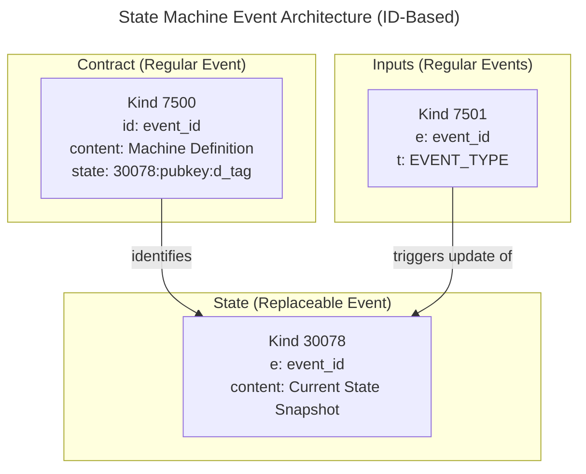

# State Machines on Nostr: A General-Purpose Protocol

## 1. Abstract

This document specifies a protocol for creating and managing verifiable, self-contained state machines over Nostr. It allows developers to model complex, multi-step processes in a decentralized environment.

The core of the protocol is a state machine, inspired by XState, which is embedded directly within a Nostr event. This allows for explicit, verifiable, and flexible management of a process's lifecycle. All state transitions are represented by Nostr events that trigger changes within this state machine.

**Why XState?** We chose XState for its robust state machine implementation that provides zero dependencies, MIT licensing, and a full ecosystem of tools for development, testing, and visualization.

This protocol focuses on the mechanics of the state machine itself. All other forms of communication between participants (e.g., negotiation) are considered to happen off-band.

## 2. Actors

- **Creator**: The user who creates the contract and defines its state machine.
- **Participant**: Any user who interacts with the state machine.

## 3. Kinds

- **Kind 7500: State Machine Definition (Regular Event)**: A regular, non-replaceable event representing the contract's static definition. Because it is a regular event, its unique `id` serves as the permanent identifier for the contract instance. Its `content` field contains a stringified JSON object defining the complete state machine.
- **Kind 30078: State Snapshot (Replaceable Event)**: A replaceable event storing the current state of the state machine. It includes an `e` tag pointing to the contract, creating a verifiable link. Its `d` tag serves as a unique identifier for the replaceable event. If the `Kind 7500` contract specifies a custodian in its `state` tag, that custodian **must** use the `d_tag` from that tag. Other custodians may choose their own `d` tag.
- **Kind 7501: State Transition Input (Regular Event)**: A regular event representing an input to the state machine. It uses an `e` tag to reference the `id` of the contract event it intends to modify. These events trigger the transitions defined in the contract.

## 4. State Machine

The lifecycle of a process is modeled as a state machine defined using an XState-like JSON structure. This definition is stored in the `content` of the **State Machine Definition** event.

### State Machine Context

The state machine includes a `context` object to store data related to the process.

### State and Definition Storage

The protocol separates the state machine's definition from its current state to achieve a more robust and decentralized security model. The state machine definition is immutable (a regular event), while the state snapshot is mutable (a replaceable event).

This separation allows the state to be custodied by any party, not just the original creator. Any user can publish a `Kind 30078` event that points to a `Kind 7500` definition, effectively becoming a custodian for that state machine.

- **Definition Storage (Kind 7500)**: The state machine's definition is stored in the `content` of the **State Machine Definition** event. This data is static and should not change.
- **State Storage (Kind 30078)**: The evolving state of the state machine is stored in the `content` of a separate **State Snapshot** event. This event's `content` contains a stringified JSON representation of the XState `State` object (the "snapshot").

### The State Custodian Model

A **State Custodian** is any party that takes on the responsibility of listening for inputs, validating transitions, and publishing updated **State Snapshot** events.

While the `state` tag in the `Kind 7500` event may point to an initial or recommended custodian, **any user or service can act as a custodian**. They can do this by publishing their own `Kind 30078` event, choosing a unique `d` tag for their replaceable event and pointing to the `Kind 7500` event's `id` in an `e` tag.

This enables a powerful security model:

- **Redundancy**: Multiple custodians can manage the state in parallel.
- **Consistency Checking**: Clients can fetch state snapshots from multiple custodians and verify that they are consistent. If a malicious custodian publishes an illegal state transition, it will be immediately obvious when compared against the state from honest custodians.
- **Decentralization**: The liveness of the state machine is not dependent on a single party (the creator).
- **Dispute Resolution**: The transparent audit trail provided by multiple custodians can be valuable for resolving disputes between participants.

## 5. Event Structure

### Event Relationship Diagram

The following diagram illustrates how the different event kinds interact. The `Kind 7500` contract is a regular event identified by its `id`. The `Kind 30078` state event and `Kind 7501` input events both reference this `id` in an `e` tag.



### Kind 7500: State Machine Definition

This is a **regular event** that defines the contract and its embedded state machine. Its `id` is the canonical identifier for the contract.

```json
{
  "kind": 7500,
  "content": "<Stringified JSON of the State Machine Definition>",
  "tags": [
    ["state", "30078:<creator-pubkey>:<d_tag>"],
    ["title", "Concise title for the contract"],
    ["description", "Detailed description of the contract"],
    ["engine", "xstate@5", "state-machine"]
  ]
}
```

- The `state` tag acts as a pointer to the coordinates of the `Kind 30078` event that holds the state machine's current state snapshot. The third parameter of the tag (`d_tag`) **must** be defined beforehand, during the creation of this `Kind 7500` event. This `d_tag` is also what the state snapshot will use for its own `d` tag.
- The `engine` tag specifies the name and version of the dependencies required to execute the state machine. Multiple `engine` tags can be included. This ensures that any client attempting to interpret the contract can use the correct logic and libraries.

### Execution Engine Dependencies

To ensure that a state machine contract remains verifiable and executable long into the future, the **State Machine Definition** can specify its execution dependencies using one or more `engine` tags. This mechanism makes the contract self-contained, removing ambiguity about the libraries and versions needed to run it.

The format for the tag is `["engine", "<name>@<version>", "<role>", ...]`.

- `<name>@<version>`: The name and version of the dependency. It can be prefixed with a package manager like `npm:`, `jsr:`, etc.
- `<role>`: A description of the engine's purpose. This allows clients to correctly apply the dependency. Common roles include:
  - `state-machine`: Specifies the engine that interprets the state machine structure itself (e.g., XState).
  - `guards`: Indicates the library provides implementations for the named guards.
  - `actions`: Indicates the library provides implementations for the named actions.

A client encountering a contract should inspect the `engine` tags to determine if it has the required dependencies to correctly interpret and execute the state machine logic.

**Examples:**

- `["engine", "xstate@5", "state-machine"]`
- `["engine", "npm:@atob/protocol-library@^0.1.0", "guards", "actions"]`

This declarative approach is vital for security and predictability, ensuring that a contract from years ago will be executed with the same version of logic it was designed for.

### Guards and Actions

The `guard` and `actions` properties in the state machine definition refer to named implementations that the client software must provide. This allows the JSON to be declarative, while the client handles the specific logic.

### XState Compatibility

The state machine definition is designed to be fully compatible with XState. The JSON string from the `content` of a **State Machine Definition** event needs to be parsed into a JavaScript object before being passed to XState's `createMachine` function. The client application must then provide the implementations for the named `actions` and `guards` in the second argument of `createMachine`.

### Why Named Guards and Actions?

The protocol uses named references for guards and actions (e.g., `"guard": "isExecutor"`) rather than embedding executable logic directly into the state machine definition. This design choice is deliberate and offers several significant advantages:

- **Security**: The most critical benefit is security. Embedding arbitrary executable code (like JavaScript snippets) within a Nostr event would be dangerous. A malicious actor could craft an event with code designed to steal keys, compromise the client, or perform other malicious actions. By keeping logic separate from the declarative data, we avoid this security risk.
- **Declarative and Clean**: The state machine definition remains pure data, clearly describing _what_ should happen (the states and transitions) without getting bogged down in _how_ it should happen (the implementation details). This makes the contract easier to read, audit, and understand.
- **Flexibility and Upgradability**: Client implementations can be improved, optimized, or have bugs fixed without requiring a new contract to be created. The logic is decoupled from the persisted data, allowing for independent evolution of the client software.
- **Consistency**: While different clients must implement the logic correctly, the specification clearly defines the expected behavior for each named guard and action, ensuring consistent behavior across the ecosystem.

While a fully self-contained state machine might seem appealing, the security and maintainability benefits of the named reference approach make it the superior choice for a robust and secure protocol.

### Client Implementation via Reference Library

To ensure consistency and simplify development, a **reference library** (e.g., a TypeScript/JavaScript package) is the recommended way to handle guard and action logic. This library would provide the standard implementations for common use cases.

**Benefits:**

- **Consistency**: All clients using the library are guaranteed to have the same, correct logic.
- **Ease of Use**: Developers can simply import the necessary functions without having to re-implement them, reducing the chance of errors.
- **Extensibility**: The library can serve as a base that developers can extend with their own custom guards and actions for new state machine types.

By providing a reference library, the protocol offers a clear and secure path for implementation, fostering a healthier and more interoperable ecosystem.

### Kind 30078: State Snapshot

This is a **parameterized replaceable event** that stores the current state snapshot of a corresponding contract.

```json
{
  "kind": 30078,
  "content": "<Stringified JSON of the XState State Object>",
  "tags": [
    ["d", "<d_tag_defined_in_the_state_tag_of_the_Kind_7500_event>"],
    ["e", "<id-of-the-kind-7500-contract-event>"],
    ["transition", "<id-of-the-last-accepted-input-event>"]
  ]
}
```

- The `d` tag is the crucial link back to the contract. It **must** contain the unique `d_tag` defined in the `state` tag of the `Kind 7500` event.
- The `transition` tag points to the `id` of the `Kind 7501` event that produced this state, marking it as the head of the canonical chain.

### Kind 7501: State Transition Input

This is a **regular event** sent by participants to trigger a state change. Its `pubkey` is used to populate the `inputterPubKey` in the state machine's context to be checked by guards.

```json
{
  "kind": 7501,
  "content": "<Optional: stringified JSON with additional event data>",
  "tags": [
    ["e", "<id-of-the-kind-7500-contract-event>"],
    ["t", "<EVENT_TYPE>"],
    ["transition", "<id-of-the-prior-input-event>"]
  ]
}
```

- The `e` tag references the `id` of the `Kind 7500` contract event, indicating which state machine this input is for.
- The `t` tag contains the event type that drives the state machine (e.g., `ACCEPT`, `START_TRANSIT`).
- The `transition` tag links this input to the previous `Kind 7501` event in the sequence, forming a verifiable chain. For the first input, this tag is omitted.

### The Role of `inputterPubKey`

The `inputterPubKey` is a crucial piece of transient data that makes the state machine's logic verifiable and secure. It is **not** part of the persisted state `context` but is dynamically added at runtime when a state transition is being processed.

Here’s its role:

1.  **Identify the Actor**: When a user sends a `Kind 7501` event to trigger a transition, their `pubkey` is the `inputterPubKey`.
2.  **Authorize Actions**: The state machine's `guards` use the `inputterPubKey` to check if the user attempting the action is authorized to do so.
3.  **Ensure Integrity**: By using the `pubkey` from the triggering event, the system ensures that only the correct participant can initiate specific state changes. A participant cannot be impersonated because the `pubkey` is cryptographically tied to the user who signed the event.

Without `inputterPubKey`, the guards would have no way of knowing _who_ is sending the command, making the system insecure.

## 6. State Management and Persistence

The state of the contract is managed through a clear, deterministic process by one or more **State Custodians**. As explained in the "State Custodian Model" section, a custodian can be the `creator`, a participant, or a dedicated third-party service.

The process is as follows:

1.  **Listen for Inputs**: The state custodian listens for **State Transition Input** (kind 7501) events that reference the **State Machine Definition**'s `id`.
2.  **Load Current State**: Upon receiving an input event, the custodian fetches the current **State Snapshot (Kind 30078)** to retrieve the current state and the `id` of the last-accepted transition from its `transition` tag.
3.  **Validate Input Lineage**: The custodian checks that the incoming `Kind 7501` event's `transition` tag matches the `id` from the current snapshot.
    - If they match (or if the input's `transition` tag is absent, for the first transition), the input is valid for the current timeline.
    - If they do not match, the input is based on a stale state and must be ignored to prevent processing out-of-order events or forks.
4.  **Load Definition and Compute Next State**: If the lineage is valid, the custodian fetches the **State Machine Definition (Kind 7500)** and computes the next state using an XState-compliant library.
    - It creates a machine instance from the definition, providing the necessary `actions` and `guards`.
    - The persisted state is restored by parsing the JSON from the state snapshot's `content`.
    - A new `context` is created that includes the `pubkey` of the incoming input event (as `inputterPubKey`).
    - The `transition` method is called on the state machine with the restored state, the event from the input (`t` tag), and the new context.
5.  **Validate State Change**: The library determines the `nextState`. The custodian checks if `nextState.changed` is `true`. If it is `false`, the input was invalid for the current state, and the process stops.
6.  **Persist New State**: If the state has changed, the custodian publishes a **new version** of the **State Snapshot (Kind 30078)** event. This new event replaces the previous one and contains:
    - The stringified JSON of the `nextState` object in its `content` field.
    - An updated `transition` tag containing the `id` of the `Kind 7501` event that was just processed.

This cycle ensures that the state is always consistent and that transitions are validated against the state machine's logic.

### State Restoration

To restore a state machine, a client must first fetch the `Kind 7500` contract and the `Kind 30078` state snapshot. It then parses the `content` of the state snapshot to restore the state machine's exact state.

```javascript
import { interpret, State } from "xstate";

// Assume 'machine' is the state machine created from the Kind 7500 contract
// using the imported guards and actions.

// Assume 'stateSnapshotEvent' is the fetched Kind 30078 event.

// 1. Get the persisted state JSON string from the state snapshot's content
const persistedStateJSON = stateSnapshotEvent.content;

// 2. Parse the JSON and create a State object
const previousState = State.create(JSON.parse(persistedStateJSON));

// 3. Start the service from the restored state
const service = interpret(machine)
  .onTransition((state) => {
    // A transition happened. Now is the time to publish a new
    // Kind 30078 event with 'state.toJSON()' as the new content.
  })
  .start(previousState);
```

## 7. Conflict Resolution and Chain Integrity

The decentralized and asynchronous nature of Nostr requires a robust mechanism for ordering events and resolving conflicts. This protocol establishes a verifiable chain of transitions and a clear model for handling forks.

### 7.1. The Transition Chain

To ensure every state change is auditable and sequential, the protocol links transition inputs into an explicit Directed Acyclic Graph (DAG).

- **Chaining Events**: Each `Kind 7501` (State Transition Input) event must point to the `id` of the prior input event that was successfully processed. This creates a cryptographic chain of events, representing the history of the state machine.
- **Declaring the Head**: The `Kind 30078` (State Snapshot) event declares the "head" of the canonical chain by pointing to the `id` of the last accepted `Kind 7501` input.

This is accomplished by adding a `transition` tag to both event kinds:

- **`Kind 7501`**: Includes a `["transition", "<prior_input_event_id>"]` tag. For the very first transition after the machine is created, this tag is omitted.
- **`Kind 30078`**: Includes a `["transition", "<last_accepted_input_event_id>"]` tag, which signals the current tip of the canonical chain.

### 7.2. Forking and Resolution

A "fork" occurs when two or more `Kind 7501` inputs are created that point to the same prior transition. Because custodians may see these events in a different order, they might process them in parallel, leading to different valid states.

**Example:**

1. The current state's last transition is `T1`.
2. `User A` creates `Input_A` pointing to `T1`.
3. `User B` creates `Input_B`, also pointing to `T1`.
4. `Custodian 1` sees `Input_A` first, computes `State_A`, and publishes a snapshot pointing to `Input_A`. It then ignores `Input_B` because it's no longer based on the chain's head.
5. `Custodian 2` sees `Input_B` first, computes `State_B`, and publishes a snapshot pointing to `Input_B`. It then ignores `Input_A`.

At this point, a fork exists. The resolution mechanism relies on the **State Custodian Model**:

- The machine's `creator` (or another party designated as authoritative) observes the fork.
- They choose a canonical path by publishing their own `Kind 30078` snapshot with the state and `last_transition_id` they endorse (e.g., `State_A` and `Input_A`).
- Honest custodians and clients see this authoritative snapshot and align their own state to the canonical chain, effectively resolving the fork.

### 7.3. Deterministic Tie-Breaking

In scenarios where no single authority is designated to resolve forks, custodians and clients can default to a deterministic tie-breaking rule to achieve eventual consistency. For example, when faced with two competing valid inputs, they could agree to prioritize the one with the lexicographically lower event `id`.

## 8. Visualization

A key advantage of using an XState-compliant definition is tool-friendliness. The JSON object from the `content` of a **State Machine Definition** can be directly pasted into the [Stately Studio](https://stately.ai/editor) to generate a visual diagram of the state machine. This is invaluable for developers, auditors, and participants to understand the contract's logic, states, and possible transitions.

## 9. Interactivity Models

### 9.1. Serverless (Creator-Managed)

The `creator`'s client acts as the state custodian and follows the process described in the **State Management and Persistence** section. This is the purest peer-to-peer implementation.

### 8.2. Server-Assisted

A trusted third-party service (a "watchtower" or "guard") monitors the state transitions without acting as the custodian. This model enhances security by providing an impartial validator.

- **Role**: The watchtower listens for state transition inputs (kind 7501).
- **Verification**: It independently runs the same state machine logic as the custodian. When it sees an input, it predicts the correct next state.
- **Action**: If the custodian (e.g., the `creator`) publishes a new state that is inconsistent with the watchtower's prediction (an illegal transition), the watchtower can flag the discrepancy by publishing a "dispute" or "invalid transition" event.

This model does not require the `creator` to grant publishing permissions to the third party. It introduces a layer of verification, making it harder for any single party to cheat. The contract could even specify a designated watchtower whose judgment is trusted by the participants.

## Appendix: A Foundation for Broader Use Cases

The underlying model is intentionally designed to be a flexible and versatile foundation for a wide range of stateful protocols over Nostr.

### A Marketplace of State Machines

The combination of a regular event (Kind 7500) to hold the immutable state machine definition, a replaceable event (Kind 30078) to hold the dynamic state, and regular events (Kind 7501) to drive transitions creates a powerful and robust pattern. This can be used to implement a "marketplace" or "catalog" of different state machines for various use cases.

By changing the JSON content of the `content` field, users can define entirely new workflows. For example:

- **Multi-Hop Processes**: A more complex state machine could be designed with multiple participant roles and states for each leg of a journey.
- **Arbitration and Oracles**: A state machine could include states for `pending_arbitration` and transitions that can only be triggered by a designated third-party oracle's pubkey, whose `isOracle` guard would validate the action.
- **Service-Level Agreements (SLAs)**: The state machine could include time-based transitions (e.g., automatically moving to a `failed_sla` state if a `deadline` is missed), which would be managed by the state custodian.
- **Decentralized Job Boards**: The core logic could be adapted for freelance work, where states might represent `job_posted`, `proposals_submitted`, `work_in_progress`, and `payment_released`.

### User-Defined Logic

This protocol empowers users to define their own logic for how a process should be handled. Any user can create a new `Kind 7500` event with a custom state machine definition. As long as clients are built to interpret this flexible structure, they can support any workflow imaginable.

This opens the door for a rich ecosystem of interoperable, user-defined, and fully auditable processes on Nostr, all built on the simple yet robust foundation of event-driven state machines.

### Encrypted State Machines

For use cases requiring enhanced privacy, an optional extension for **Encrypted State Machines** is available. This extension builds upon the foundation of this protocol to encrypt the state machine's `context` and `state`, ensuring that sensitive data remains confidential while still leveraging the same verifiable, event-driven architecture.

This allows participants to engage in private processes where the state's data is only visible to authorized parties, without compromising the integrity of the state transitions themselves.

For a detailed specification, see [Encrypted State Machines](./encrypted-state-machines.md).
